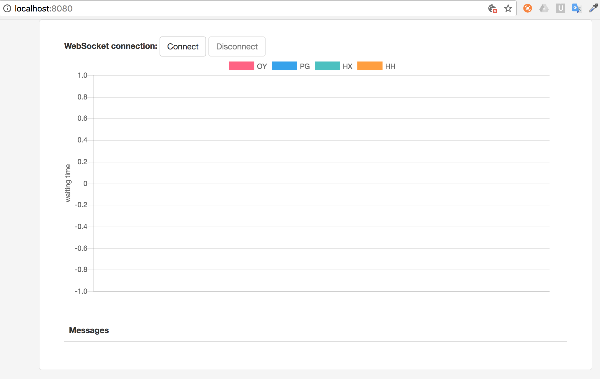

# Live dashboard with Kafka Streaming and Websockets

This is an example on how to use Kafka Streamin API to aggregate logs and display results online in a dashboard. 

Read detailed description in:  [EBI TSC Blog](http://www.ebi.ac.uk/about/technology)

Tools:
-------------------

1. Java 8+
2. Apache Kafka 0.11
3. Spring Boot
4. STOMP 
5. Chart.js

How to run:
--------

0. Follow step 1 and step 2 of [Kafka Quickstart](https://kafka.apache.org/quickstart) 

1. Create two topics: data-in and data-out

  `bin/kafka-topics.sh --create --zookeeper localhost:2181 --replication-factor 1 --partitions 1 --topic data-in`
  `bin/kafka-topics.sh --create --zookeeper localhost:2181 --replication-factor 1 --partitions 1 --topic data-out`

2. Clone and build java project
    
   `git clone https://github.com/sajmmon/kafka-streaming-websockets.git`
   `cd kafka-streaming-websockets`
   `mvn clean package`

3. Run producer

   `java -cp target/shade-kafka-streaming-websockets-0.1.0.jar uk.ac.ebi.produce.KafkaExampleProducer`
   
4. Run streaming client

   `java -cp target/shade-kafka-streaming-websockets-0.1.0.jar uk.ac.ebi.streaming.KafkaStreamingMain`
   
5. Run spring boot

   `java -cp target/shade-kafka-streaming-websockets-0.1.0.jar uk.ac.ebi.Application`

6. See live dashboard in [localhost:8080](http://localhost:8080)

When you click "Connect" you should see:

And after some time more data points will be visible:

Recommended resources:
----------------------

0. [Kafka Streaming (by Gwen Shapira)](https://github.com/gwenshap/kafka-streams-stockstats)
1. [Using WebSocket with Spring Boot (by Pivotal)](https://spring.io/guides/gs/messaging-stomp-websocket/)
1. [Apache Kafka with Spring (by Baeldung)](http://www.baeldung.com/spring-kafka)
1. [Kafka Streams Examples (by Confluent)](https://github.com/confluentinc/examples/tree/3.3.0-post/kafka-streams)
2. [Creating custom serializers (by Niels.nu)](http://niels.nu/blog/2016/kafka-custom-serializers.html)