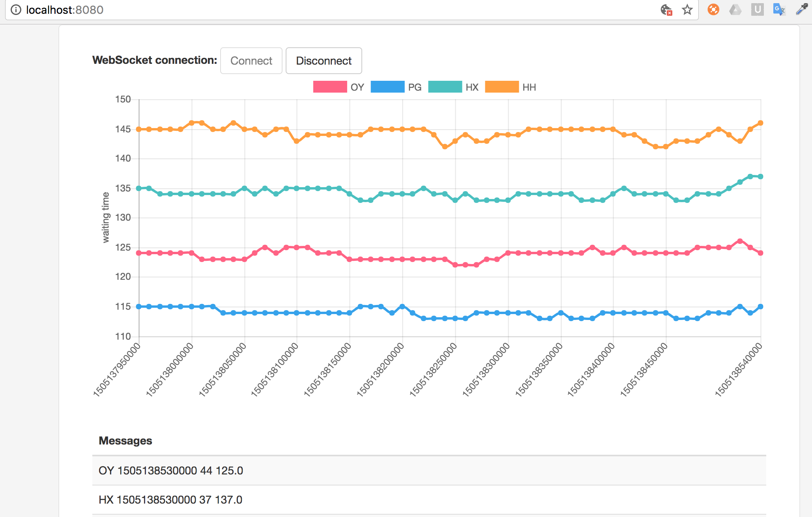

# Live dashboard with Kafka Streams API

This is an example on how to use Kafka Streams API to aggregate logs and display results online in a dashboard. 

Genome Campus Software Craftsmanship [Meetup](https://www.meetup.com/pl-PL/Genome-Campus-Software-Craftsmanship-Community/events/243518985/)

Tools:
-------------------

1. Java 8+
2. Apache Kafka 0.11
3. Apache Kafka Streams API
4. Spring Boot
5. STOMP 
6. Chart.js

How to run:
--------

1. Follow step 1 and step 2 of [Kafka Quickstart](https://kafka.apache.org/quickstart) 

2. Create two topics: data-in and data-out

   ```bin/kafka-topics.sh --create --zookeeper localhost:2181 --replication-factor 1 --partitions 1 --topic data-in```
  
   ```bin/kafka-topics.sh --create --zookeeper localhost:2181 --replication-factor 1 --partitions 1 --topic data-out```

3. Clone and build java project
    
   ```git clone https://github.com/ebi-wp/kafka-streams-api-websockets.git```
   
   ```cd kafka-streaming-websockets```
   
   ```mvn clean package```

4. Run producer

   ```java -cp target/shade-kafka-streaming-websockets-0.1.0.jar uk.ac.ebi.produce.KafkaExampleProducer```
   
5. Run streaming client

   ```java -cp target/shade-kafka-streaming-websockets-0.1.0.jar uk.ac.ebi.streaming.KafkaStreamingMain```
   
6. Run spring boot

   ```java -cp target/shade-kafka-streaming-websockets-0.1.0.jar uk.ac.ebi.Application```

7. See live dashboard in [localhost:8080](http://localhost:8080)

When you click "Connect" you should see:




Recommended resources:
----------------------

1. [Kafka Streaming (by Gwen Shapira)](https://github.com/gwenshap/kafka-streams-stockstats)
2. [Using WebSocket with Spring Boot (by Pivotal)](https://spring.io/guides/gs/messaging-stomp-websocket/)
3. [Apache Kafka with Spring (by Baeldung)](http://www.baeldung.com/spring-kafka)
4. [Kafka Streams Examples (by Confluent)](https://github.com/confluentinc/examples/tree/3.3.0-post/kafka-streams)
5. [Creating custom serializers (by Niels.nu)](http://niels.nu/blog/2016/kafka-custom-serializers.html)

Issues:
-------
If you run without internet access you might need to add following to *config/server.properties*
```
advertised.host.name = localhost
advertised.port = 9092
```
